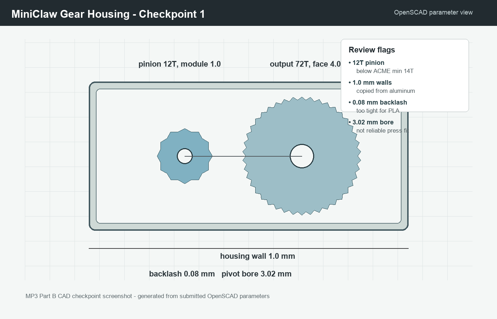
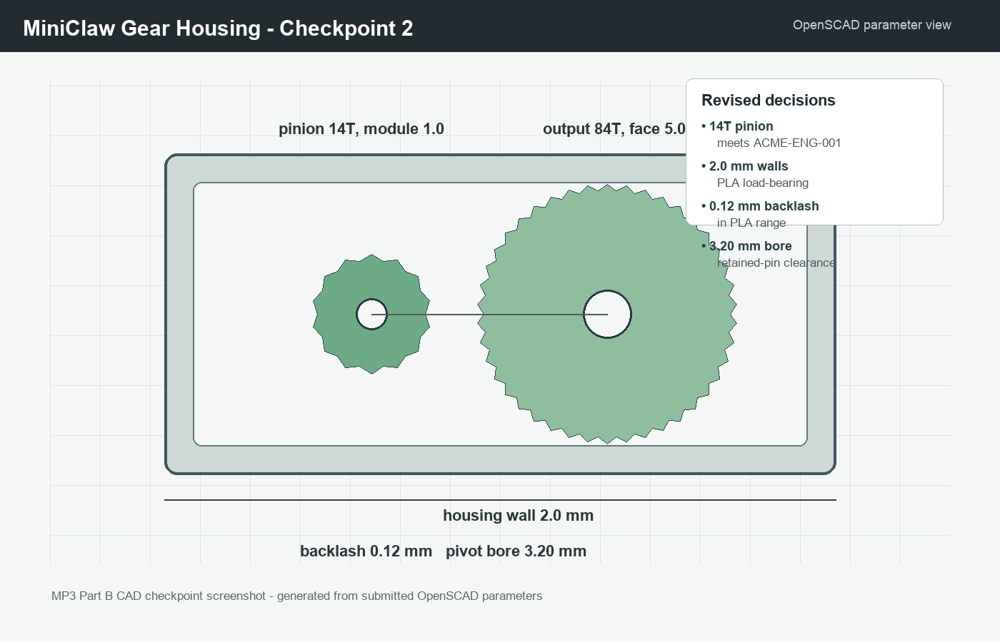

# MiniClaw CAD Interaction

**Goal:** Iterate the MiniClaw jaw-drive housing before release by checking
whether a BigClaw-inspired spur gear and PLA housing can survive ACME's
printed-part constraints. I focused on the gear/housing subassembly because it
sets the grip feel, gear mesh, pivot alignment, and most of the print-risk for
the 500-unit RobotExpo run.

**Subassembly:** Gear-driven jaw housing  
**CAD tool:** OpenSCAD parameter model, documented in `miniclaw_drive_v1.scad`
and `miniclaw_drive_v2.scad`  
**Skill loaded:** `skills/miniclaw_gear_dfm_review.md`  
**MCP server connected:** `mcp_server/server.py`, with corresponding calls in
`mcp_server/logs/server.log`

## Checkpoint 1 — First Pass

**Prompt sent to AI host with screenshot in context:**

> I am reviewing this first-pass MiniClaw jaw-drive housing. It uses a
> 12T-to-72T module 1.0 PLA gear pair, 4 mm face width, 0.08 mm backlash,
> 1.0 mm housing walls copied from the BigClaw teardown, and a 3.02 mm bore for
> a 3.00 mm pivot pin. Use the MiniClaw skill and MCP server. What should I
> flag before I commit the CAD?

**Host evidence:** `../mcp_server/screenshots/tool_call_checkpoint1.png`

**AI response captured:**

> Calling `query_miniclaw_rag` for MiniClaw gear, BigClaw wall, and press-fit
> constraints.
>
> Three items need changes before release. First, `ACME-ENG-001` says module
> 1.0 printed gears need at least 14 teeth, so the 12T pinion is below the
> standard even though the 4 mm face width is acceptable. Second, `ACME-VND-002`
> says BigClaw's 0.8-1.2 mm walls are aluminum; MiniClaw PLA should use at
> least 1.5 mm and probably 2.0 mm in load-bearing areas. Third, `ACME-MFG-001`
> and `ACME-ENG-003` make a 0.02 mm press-fit offset unrealistic across the
> RobotExpo production run.

**What changed after Checkpoint 1:** I changed the pinion from 12T to 14T,
changed the driven gear from 72T to 84T to preserve a 6:1 ratio, widened the
face width from 4 mm to 5 mm, opened backlash from 0.08 mm to 0.12 mm, and
increased housing walls from 1.0 mm to 2.0 mm. I also rejected the AI's implied
"fix" of simply tightening the bore tolerance: because `ACME-MFG-001` only
supports +/-0.15 mm press-fit reliability across production, I changed the
pivot to a clearance bore with a retained pin instead.

## Checkpoint 2 — Revised CAD

**Prompt sent to AI host with screenshot in context:**

> I revised the MiniClaw drive housing: 14T-to-84T module 1.0 gears, 5 mm face,
> 0.12 mm backlash, 2.0 mm load-bearing walls, and a 3.20 mm retained-pin bore
> instead of a press fit. Use the MiniClaw skill and MCP server. Anything else
> to flag before I freeze this version?

**Host evidence:** `../mcp_server/screenshots/tool_call_checkpoint2.png`

**AI response captured:**

> Calling `query_miniclaw_rag` for ACME-ENG-001, ACME-MFG-002, and
> ACME-ENG-003.
>
> The revised gear pair now matches the module 1.0 tooth-count rule and keeps
> backlash in the 0.10-0.15 mm PLA range. The 5 mm face width is inside the
> 4-6x module production recommendation. Keep the flat print orientation and
> 100% infill note because `ACME-MFG-002` makes interlayer adhesion the
> governing printed-gear failure mode. Add an explicit drawing note that the
> gear cavity is printed as one housing, because `ACME-ENG-003` recommends this
> for MiniClaw gear-center consistency.

**What changed after Checkpoint 2:** I added the print note "GEARS PRINT FLAT,
100% INFILL" and the assembly note "GEAR CAVITY PRINTED AS ONE HOUSING." I did
not accept the AI suggestion to increase the output gear again for more
mechanical advantage, because the assignment goal was to stabilize a compact
6:1 drive package rather than maximize force at the cost of envelope size.

## Iteration Summary

The useful AI contribution was not a new CAD concept; it was a faster check
against ACME-specific constraints. The stack connected the visible CAD choices
to `ACME-ENG-001`, `ACME-VND-002`, `ACME-MFG-001`, `ACME-MFG-002`, and
`ACME-ENG-003`. My human overrides were the press-fit decision at Checkpoint 1
and the gear-ratio decision at Checkpoint 2: in both cases, I chose a more
manufacturable or more compact design target instead of following a generic
optimization path.
