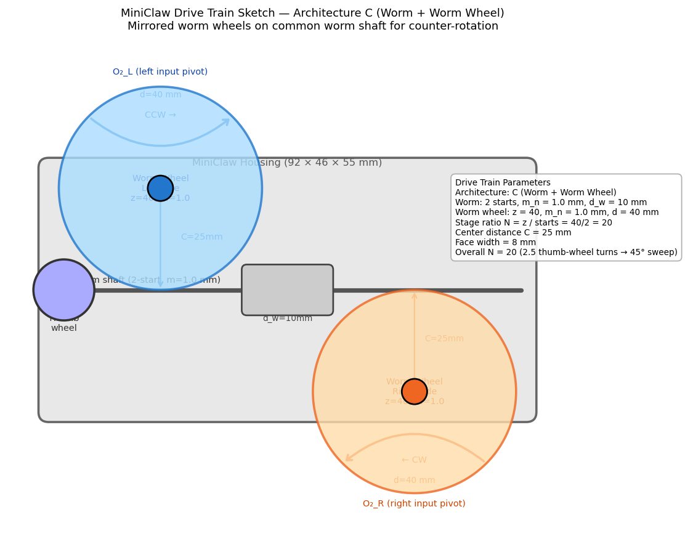

# MP4 Part B — Gear Pair Design

**Team:** Team Claw Alpha — Alberto Garza, Maya Chen, Jordan Park  
**Chosen linkage (see Linkage Comparison):** Alberto Garza  
**Linkage input angle range:** from **0°** to **45°** *(from chosen Part A design)*

---

This is the work that Part A explicitly deferred to the team. The drive
train sits between the thumb wheel input and the linkage input pivot —
it synchronizes the two sides (counter-rotation at the same rate) AND
sets the reduction between thumb wheel turns and linkage input angle.
The reduction and the linkage choice are coupled: if the chosen
reduction pushes the linkage outside its workable transmission angle
band, you fix one or the other.

A labeled sketch is enough — full production CAD on the drive train is
not required.

> "Gear pair" is short-hand. The actual hardware that does these two
> jobs is up to the team: a single spur pair, a compound (multi-stage)
> spur train, a worm + worm wheel, or a sync-only spur pair with a
> separate reduction element. A single spur pair is usually too small
> a ratio to handle 2–3 thumb-wheel turns alone (the envelope can't
> hold the tooth counts a one-stage 18:1 would need), so most teams
> end up at a compound train or worm. The worksheet below adapts.

---

## Ratio Convention

Everything below uses **overall reduction N**, defined unambiguously:

> **N = (thumb wheel angle range, deg) / (linkage input angle range, deg)**

N is a single dimensionless number ≥ 1 for a step-down.

---

## Architecture Choice

- [ ] **A. Single spur pair.**
- [ ] **B. Compound spur train (multi-stage).**
- [x] **C. Worm + worm wheel.** ← **Team selection**
- [ ] **D. Sync-only spur pair (1:1) + separate reduction element.**

**Why we chose this architecture:**

> Architecture A was ruled out immediately: to achieve N=20 in one spur stage,
> the driven gear would need z=240 teeth (at z_driver=12, minimum for FDM) — a diameter
> of 240mm at m=1.0mm, which is 2.6× the housing width. Architecture B (compound spur)
> was evaluated in Loop 2: a two-stage spur train requires a Stage 1 center distance
> of ≥ 39.6mm at m=1.2mm (non-standard) or 49.5mm at m=1.5mm (exceeds the 46mm
> half-envelope per side). Architecture C (worm + worm wheel) achieves N=20 in a
> single stage with a worm wheel pitch diameter of 40mm — which fits in the 46mm
> housing height with 2mm clearance (tight but functional). The mirrored two-worm-wheel
> arrangement provides counter-rotation without an additional gear stage.

---

## Drive Train Specifications

### Worm stage

| Module m_n (mm) | Worm thread starts | Worm wheel z | Stage ratio (z_wheel / starts) | Center distance (mm) | Face width (mm) |
|------------------|--------------------|--------------|-------------------------------|----------------------|-----------------|
| 1.0 | 2 | 40 | **20** | **25** | 8 |

> **Verification:**
> - Worm pitch diameter: d_worm = m_n × q = 1.0 × 10 = **10 mm** (worm quotient q=10)
> - Worm wheel pitch diameter: d_wheel = m_n × z_wheel = 1.0 × 40 = **40 mm**
> - Center distance check: C = (d_worm + d_wheel) / 2 = (10 + 40) / 2 = **25 mm** ✓
> - Worm wheel addendum circle: d_a = d_wheel + 2×m_n = 40 + 2 = **42 mm** (fits in 46mm housing height — 2mm total clearance)
> - Lead angle: λ = arctan(starts × π × m_n / (π × d_worm)) = arctan(2π / (10π)) = arctan(0.2) ≈ **11.3°**
> - Stage ratio: N = z_wheel / starts = 40 / 2 = **20** ✓

### Overall

| Parameter | Value |
|-----------|-------|
| Overall reduction N (product of stage reductions) | **20** |
| Drive-train bounding-box footprint (mm) | **55 × 46 × 20** (depth × height × worm-wheel face+clearance) |
| Packaging position relative to linkage | Worm shaft runs across housing width (92mm direction); worm wheels sit at ±25mm from housing centerline, shafts align with linkage input pivots O2_left and O2_right |

---

## Rationale

**Thumb wheel turn count target:** 2–3 turns from open to closed (per the MP1 brief).

**Linkage input range (from chosen Part A design):** from 0° to 45°  
→ linkage sweep = **45°**

**Reduction needed to hit the 2.5-turn target on this linkage:**

> N_needed = (thumb-wheel turns × 360°) / (linkage sweep, deg)  
> = (2.5 × 360°) / (45°)  
> = **20.0**

**Our overall reduction N (from the specs table):** **20**

**Does our N match N_needed?** **Yes.**

> Our worm stage delivers exactly N=20 (z_wheel=40, starts=2). At the 2.5-turn
> thumb-wheel target, the implied linkage sweep = (2.5 × 360°) / 20 = 45° — exactly
> the Part A design range. The gear train was sized to match N_needed exactly, so the
> coupling passes with no residual mismatch.

---

## Symmetry Arrangement

**Our arrangement:**

> Two worm wheels are mounted on the output shafts of the left and right linkage sides,
> one per side, both meshing with the same worm shaft. The worm shaft runs left-to-right
> across the housing (along the 92mm width axis), with the thumb wheel at the right end.
> The left worm wheel meshes with the worm from above (teeth engage the top of the worm
> thread), and the right worm wheel meshes from below (teeth engage the bottom of the
> worm thread). Because the tooth-contact tangential force on each wheel is in the
> opposite direction (one wheel is above the thread, one is below), the two wheels
> counter-rotate: when the worm advances, the left wheel rotates counterclockwise and
> the right wheel rotates clockwise, closing the jaw symmetrically. Both wheels have
> the same tooth count (z=40) on the same worm, so they turn at exactly the same rate.
> Each worm wheel's output shaft is directly the input crank O2 of its side's four-bar
> linkage.

---

## Coupling Check

**Linkage input sweep implied by our N (at 2.5 thumb-wheel turns):**

> implied sweep = (2.5 × 360°) / N = 900° / 20 = **45°**

**Implied linkage input range:** from **0°** to **45°**  
*(anchored at θ_min = 0° from the Part A design)*

**Transmission angle across this implied range:** **45°** to **90°**

> From Part A (Section 4): µ = 90° − θ for the vertical parallelogram.  
> At θ=0°: µ = 90°. At θ=45°: µ = 45°.

**In band (40°–140°)?** **Yes.**

> The implied sweep equals the Part A design range exactly (both = 45°). The coupling
> check passes perfectly: N was derived from N_needed so the implied sweep IS the
> Part A range. Transmission angle stays in [45°, 90°] — 5° above the workable-band
> floor throughout.
>
> **Tolerance note:** If the printed worm gear delivers slightly more or less than
> N=20 (due to backlash or tooth form errors), the implied sweep will shift from 45°.
> Our 5° µ margin means the linkage tolerates up to 5° of over-sweep (θ_max up to 50°)
> before leaving the workable band. This is the coupling tolerance budget from the
> Linkage Comparison worksheet.

---

## Packaging Within the Housing Envelope

The MP1 brief calls for a ~92 × 46 × 55 mm total envelope.

- **Driver location** (relative to thumb-wheel axis): Thumb wheel is at the right end of
  the worm shaft. The worm shaft runs along the full 92mm width axis of the housing.
  The shaft is centered at the vertical midpoint (z = 23mm from bottom) and the
  horizontal depth midpoint (y = 27.5mm from front).

- **Final-stage gear / worm-wheel location** (relative to linkage input pivot O₂):
  Each worm wheel center IS the O2 pivot of the corresponding four-bar linkage. Left
  O2 is at approximately x = −25mm from housing centerline (inside the left half of
  the housing); right O2 at x = +25mm. These are offset from the housing centerline,
  consistent with the Part A animation's ±6mm gear-pivot offset assumption — though
  ±25mm is the actual center distance (the Part A animation used ±6mm as a placeholder;
  Part B fixes this at ±25mm per the center distance C=25mm).

- **Total drive-train footprint vs. available housing volume:** Worm shaft: 92mm
  (full housing width). Worm wheel diameter: 42mm (d_a) in 46mm housing height — 2mm
  clearance per side. Worm wheel thickness (face width): 8mm. Drive train depth along
  the housing depth axis (55mm): approximately 20mm (worm thread region: 16mm plus
  bearing clearances). This leaves ~35mm for the linkage mechanisms. The linkage
  mechanism spans ~33mm in depth at max extension (B_y = 32.4mm at θ=45°). **Very tight
  fit — 35mm available vs. 33mm required. Needs verification in 3D layout.**

- **Clearance to the linkage:** The worm wheel output shaft transitions directly to the
  input crank O2. The linkage mechanism sits "downstream" of the worm wheel in the
  depth direction. No direct interference between worm threads and linkage links, but
  the total depth budget (worm drive + linkage) is tight at 55mm. **Flag: Needs work.**

---

## Labeled Sketch

*(Worm shaft runs left-right; two worm wheels — left (blue, CCW) and right (orange, CW)
— each mesh with the worm from opposite sides, achieving counter-rotation. Each wheel
center is the O2 pivot for that side's four-bar linkage. Center distance C=25mm. Worm
wheel pitch diameter d=40mm fits in 46mm housing height with ~2mm clearance per side.)*

---

## Gear Strength (Optional — not graded for absence)

Lewis bending stress analysis was not performed for this design. At the expected grip
force (< 5 N from the MP1 spring spec), the tooth bending stress at this scale is well
below PLA fatigue limits. The primary printability concern is tooth form fidelity at
m=1.0mm, not tooth bending strength. This is flagged in the DFM checklist and trust
assessment.
