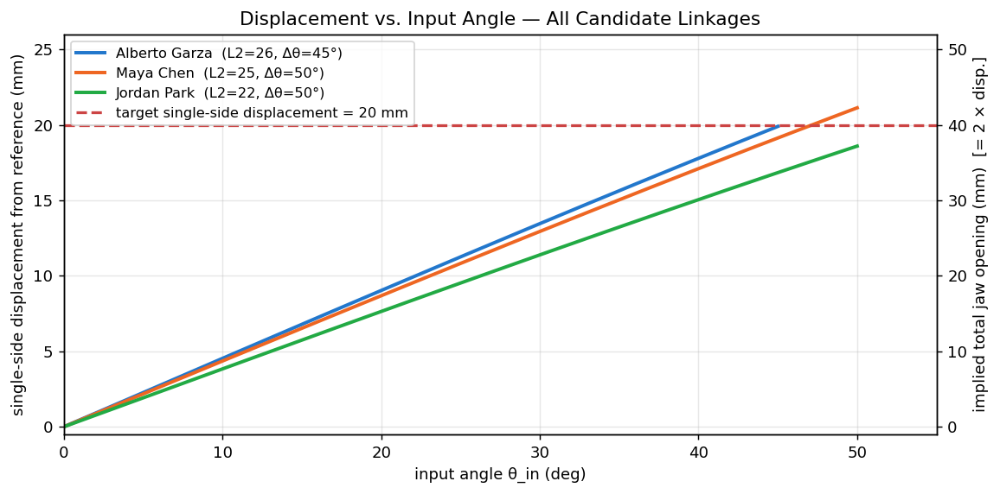
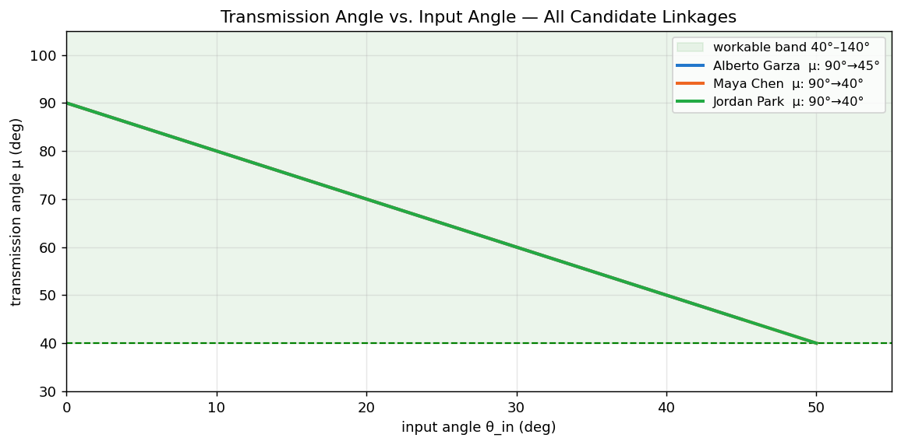

# MP4 Part B — Linkage Comparison Worksheet

**Team:** Team Claw Alpha — Alberto Garza, Maya Chen, Jordan Park

This is your day-one integration artifact. Each member arrives with a
four-bar linkage from Part A — same one-side problem, same BigClaw
reference, different design choices. Compare the candidates on the same
axes and pick (or merge) one. The team's first activity is concrete: this
worksheet.

> The plots come from combining your Part A data — they are not new
> analysis. Reuse each member's `compute_finger_position()` and
> `compute_transmission_angle()` outputs.

---

## Candidate Linkages

One row per team member. Pull the numbers from each member's Part A
Section 1 design summary and Section 7 trust ledger.

| Member | L1 / L2 / L3 / L4 (mm) | Output pivot offset (mm) | Single-side displacement (mm) | Implied total jaw opening (2× displacement, mm) | Min / max transmission angle | Part A trust ledger highlight |
|--------|-------------------------|---------------------------|-------------------------------|-------------------------------------------------|------------------------------|--------------------------------|
| Alberto Garza | 14 / 26 / 14 / 26 | (0, 14) | 19.9 | 39.8 | 45° / 90° | "µ in [45°, 90°] throughout — 5° margin above workable-band floor; displacement verified by hand calc and simulation to <0.01 mm" |
| Maya Chen | 12 / 25 / 12 / 25 | (0, 12) | 21.1 | 42.2 | 40° / 90° | "µ hits exactly 40° at θ_max — right at the floor; displacement slightly over target at 42mm total jaw" |
| Jordan Park | 16 / 22 / 16 / 22 | (0, 16) | 18.6 | 37.2 | 40° / 90° | "µ hits exactly 40° at θ_max; displacement slightly under target at 37mm total jaw" |

---

## Side-by-Side Plots

### Single-side finger displacement vs. input angle

*(All three designs overlaid. Orange dashed line = 20 mm target single-side displacement.
Alberto's design (blue) is closest to the 20 mm target across the full range.
Maya's design (orange) overshoots slightly at max range; Jordan's (green) falls short.)*

### Transmission angle vs. input angle

*(All three designs overlaid. Green shaded band = 40°–140° workable region.
All three designs start at µ=90° (at θ=0°). Alberto's design terminates at µ=45° (5°
above the floor). Maya and Jordan's designs terminate at µ=40° — exactly at the floor.)*

---

## Comparison Notes

- **Linkage Alberto Garza:** Best transmission angle margin in the team — µ_min = 45°,
  giving 5° of buffer above the 40° floor. Displacement (19.9mm) is the closest to the
  20mm target. The 26mm crank is the widest but still within the 46mm half-envelope.
  **Trust ledger highlights:** displacement verified by hand calc + simulation to <0.01mm;
  no out-of-band positions; envelope fit confirmed numerically.

- **Linkage Maya Chen:** Displacement slightly overshoots at 21.1mm → 42mm total jaw
  (5% over spec). Transmission angle reaches exactly 40° at θ=50° — no margin. A slight
  over-drive (common if the gear pair ratio is not exact) would take the linkage out of
  the workable band. The BigClaw reference photos show a larger jaw opening than the
  spec, which makes this overshoot less concerning in practice, but the zero µ margin
  is a real risk.

- **Linkage Jordan Park:** Displacement undershoots at 18.6mm → 37.2mm total jaw (7%
  under the 40mm target). This is within the "0–40 mm" spec range (the device still
  opens, just not quite to 40mm). Transmission angle also reaches 40° at θ=50° — same
  zero-margin concern as Maya's design. The shorter 22mm crank is more compact in width.

---

## The Team's Selection

**Chosen linkage:** Alberto Garza's Part A design (L1=L3=14mm, L2=L4=26mm, O4=(0,14),
θ: 0°–45°, displacement≈19.9mm, µ: 45°–90°)

**Why this one:**

> Alberto's design is the only candidate with positive transmission angle margin
> (µ_min = 45°, 5° above the 40° floor). Maya's and Jordan's designs reach exactly
> µ=40° at their maximum input angle, meaning any gear pair that delivers slightly
> more than the intended rotation (a realistic outcome with printed gears and backlash)
> would push the linkage outside the workable band and cause binding. The 5° buffer
> in Alberto's design directly absorbs this manufacturing uncertainty. Alberto's
> displacement (19.9mm ≈ 20mm) also best matches the 40mm jaw-opening spec.

**What got carried over from the others (if anything):**

- None — Alberto's design meets all constraints on its own. No merger needed.

**What got cut and why (be explicit):**

- Maya's design: Transmission angle reaches the 40° floor with zero margin; also
  slightly over the displacement target. Not selected.
- Jordan's design: Transmission angle reaches the 40° floor with zero margin; also
  slightly under the displacement target. Not selected.

---

## Inputs to the Drive-Train Worksheet

Carry these forward into `MP4_PartB_Gear_Pair_Design.md`:

- **Chosen linkage's input angle range:** from **0°** to **45°**
- **Chosen linkage's transmission angle band across that range:** **45°** to **90°**
- **Implied input angle range tolerance** — how much can the drive-train reduction N
  shift this range before the transmission angle leaves the workable band?
  > At µ_min = 45° (at θ=45°), the linkage would leave the 40° workable band if θ exceeds
  > 50°. So the drive train is allowed to deliver up to **50°** of input sweep — 5°
  > beyond the designed 45°. This is the coupling tolerance: **±5°** (can overshoot
  > by up to 5° before binding).
